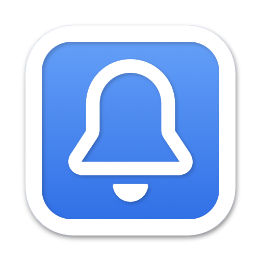

    
    <h1>
      GitHub Notifications
    </h1>
    

      <strong>🔔 Get GitHub's notifications directly on your Mac Status Bar</strong>
    

     
     
     

This macOS application is useful to let you know when you have notifications on
your GitHub account.

Require macOS 10.15 or later.

  

## Download

https://github.com/yoannfleurydev/GitHub-Notifications/releases

## Features

### Know when you have a notification

By default, the application is a simple icon in your macOS status bar, and a
little indicator appears when you have notifications.

### Access [github.com/notifications](https://github.com/notifications) from the menu first item

Click on the application in the status bar, and then click on the menu first
item to access the [GitHub Notifications](https://github.com/notifications)
page.

## FAQ

### I can't paste my Personal Access Token using keyboard shortcut.

> You have to right click in the field in order to paste your personal access
> token as the keyboard shortcut is not yet implemented.

---

## My others git related projects

- [gitweb](https://github.com/yoannfleurydev/gitweb) 🌲 Open the current remote repository in your browser
